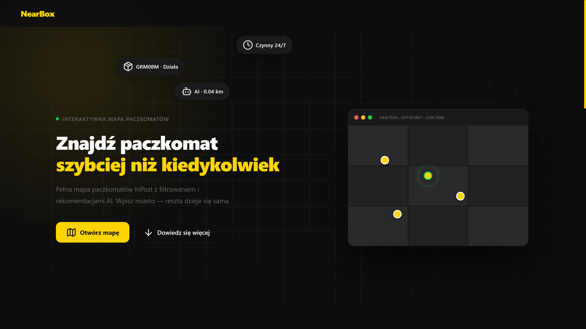
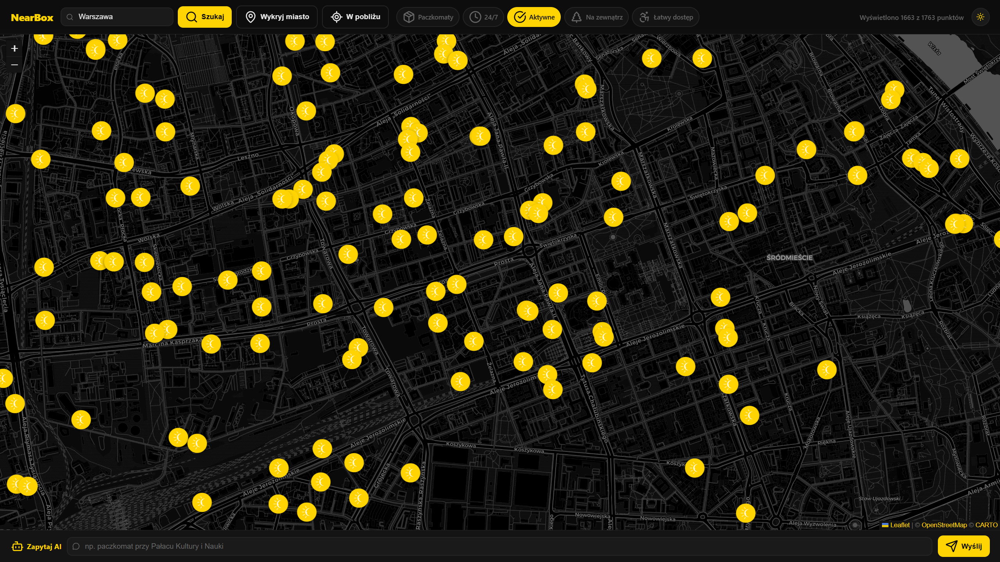
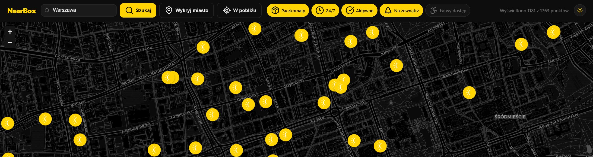
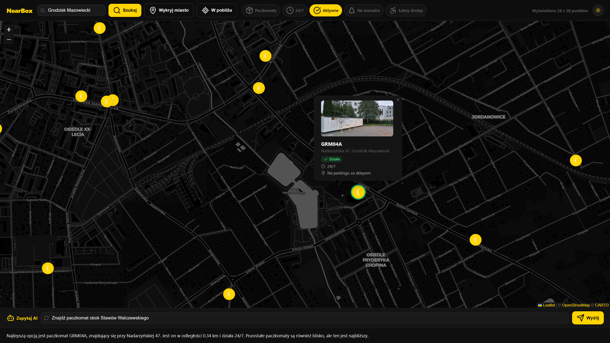

# NearBox — Smart Parcel Locker Finder

## Author

- **Name:** Krzysztof Januszewski
- **Email:** kmjanuszewski@outlook.com

## Overview

NearBox is a web application that helps users find the best InPost parcel locker for their needs. It combines real-time locker data from the InPost API with an AI-powered recommendation engine, letting users search by city, filter by locker features, and get a personalized suggestion in plain language.

## Demo & Description

### How it works

The user types a city name — NearBox fetches all InPost points in that area directly from the InPost API, renders them on an interactive map, and lets the user filter by:

- **Locker type**
- **24/7 availability**
- **Operational status** (working only)
- **Location type** (outdoor / indoor)
- **Easy access**

On top of that, the user can describe their situation in plain language — *"I need a locker near a pharmacy"* — and the built-in AI assistant (powered by OpenAI) picks the single best match from the visible results and explains why.

### Deployed solution

🔗 [https://nearbox.onrender.com](https://nearbox.onrender.com)

### Screenshots

**1. Landing page**

Dark-themed hero screen with floating locker status badges, a bold headline, and a browser mockup previewing the live map.



**2. Main view — map with lockers loaded for a city**

Map with all parcel lockers loaded for the selected city — markers are color-coded by operational status.



**3. Filters in action**

The filter panel in use — enabling "24/7" and "working only" instantly updates the visible markers on the map.



**4. AI recommendation**

The AI assistant identifies the best locker based on the user's plain-language description and explains its choice.



**5. AI Easter egg**

When the user asks something unrelated to parcel lockers, the AI responds with a touch of humor and politely steers the conversation back on track.


---

## Technologies

| Technology | Role | Why |
|---|---|---|
| **Django 6** | Backend / API | My strongest stack — I feel most confident here, so it was the natural choice |
| **HTML, CSS, JS** | Frontend | The technologies I'm most comfortable with on the frontend side; they integrate seamlessly with Django's templating system |
| **Leaflet.js** | Interactive map | Lightweight, open-source, no API key required unlike Google Maps |
| **OpenAI API (GPT-4o)** | AI recommendations | Best-in-class natural language understanding for user intent |
| **Google Geocoding API** | Address geocoding | Converts a city name into coordinates to center the map |
| **Docker** | Containerization | Reproducible environment — works identically locally and on the server |
| **Render** | Hosting | Free tier with unrestricted external API access and native Dockerfile support |


## How to run

### Prerequisites

- Docker + Docker Compose
- API keys: `OPENAI_API_KEY`, `GOOGLE_MAPS_API_KEY`

### Build & run

```bash
git clone https://github.com/Adsutori/NearBox.git
cd NearBox
```

Create a `.env` file in the root directory:

```env
SECRET_KEY=your-django-secret-key
OPENAI_API_KEY=sk-...
GOOGLE_MAPS_API_KEY=AIza...
DJANGO_ALLOWED_HOSTS=localhost,127.0.0.1
```

Run:

```bash
docker compose up --build
```

The application will be available at: [http://localhost:8000](http://localhost:8000)

---

## What I would do with more time

**1. Address-level search, not just city**

Users could type a specific street address and see the N nearest lockers sorted by distance.

**2. "On the way" mode**

Point A → Point B — show lockers within a set buffer around the route. A real use case for people commuting to work.

**3. More advanced AI functionality**

Currently the AI acts as a one-shot advisor. Given more time, I would turn it into a proper conversational interface: the AI would remember the context of the conversation, ask clarifying questions, and iteratively narrow down the best option.

---

## AI usage

Yes — I used Claude and ChatGPT extensively throughout the project.

**Where AI helped:**

- **Frontend** — due to the limited time available, the majority of the frontend layer was built with heavy AI assistance. Every piece of code was read, understood, and in many places modified by me — AI acted as a fast collaborator, not an autopilot.

- **Technology selection for the AI module** — I worked with AI to evaluate available geocoding and recommendation options. I ultimately chose Google Geocoding API for city-to-coordinates conversion and GPT-4o for natural language recommendations. AI helped me assess the trade-offs (cost, accuracy, ease of integration) before making the final call.

- **Distance calculation system** — AI helped me design the logic for finding the nearest lockers relative to a user-provided location.

- **Debugging** — AI was the first line of support for harder bugs, such as incorrect distance calculations between lockers and user-specified landmarks.

**How I verified the output:**
I read every piece of AI-generated code line by line before using it. Several times AI proposed solutions that worked but were unnecessary — for example, server-side filtering that I was already handling client-side. I removed those consciously and understand every part of the codebase I can be asked about.

---